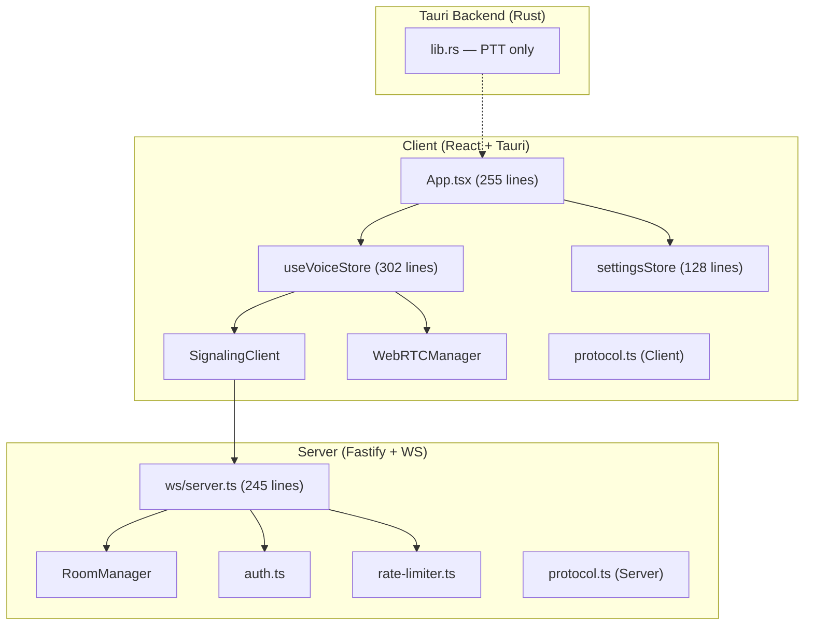

# Vvoice Codebase Analysis Report

> **Date:** 2026-02-15  
> **Scope:** Full-stack analysis — Server (Node/Fastify), Client (React/Vite), Tauri Backend (Rust)  
> **Lines of Code:** ~3,500 (excluding tests, CSS, configs)

---

## Table of Contents

1. [Architecture Overview](#1-architecture-overview)
2. [Code Quality Findings](#2-code-quality-findings)
   - [SOLID Violations](#21-solid-violations)
   - [DRY Violations](#22-dry-violations)
   - [KISS Violations](#23-kiss-violations)
   - [Error Handling](#24-error-handling)
3. [Security Audit](#3-security-audit)
4. [Performance & Scalability](#4-performance--scalability)
5. [Feature Gaps & Suggestions](#5-feature-gaps--suggestions)
6. [Priority Roadmap](#6-priority-roadmap)

---

## 1. Architecture Overview



The codebase follows a clean three-tier architecture. The signaling server handles authentication, room management, and WebRTC offer/answer/ICE relay. The client is a React SPA wrapped in Tauri for desktop features (system tray, PTT global shortcuts). The Rust layer is currently minimal — only Push-to-Talk key detection.

**Overall Grade: B-** — Good foundation, but several code quality and security issues need addressing before production.

---

## 2. Code Quality Findings

### 2.1 SOLID Violations

#### 🔴 Single Responsibility Principle (SRP)

| File | Problem | Severity |
|:---|:---|:---:|
| [server.ts](file:///c:/Users/Zhitn/Desktop/Vvoice/server/src/ws/server.ts) | **245-line monolith.** Handles connection lifecycle, authentication, room operations, chat, WebRTC relay, rate limiting, broadcasting, and logging — all in a single function scope. | **Critical** |
| [App.tsx](file:///c:/Users/Zhitn/Desktop/Vvoice/client/src/App.tsx) | **255 lines.** Renders sidebar, channel tree, user card, control bar, header, chat area, and modals. Should be decomposed into `Sidebar`, `UserCard`, `ControlBar`, and `MainContent` components. | **High** |
| [useVoiceStore.ts](file:///c:/Users/Zhitn/Desktop/Vvoice/client/src/store/useVoiceStore.ts) | **302 lines.** Manages connection, audio, channels, users, messages, _and_ WebRTC lifecycle. The store doubles as a service layer because it directly orchestrates `SignalingClient` and `WebRTCManager`. | **High** |
| [index.css](file:///c:/Users/Zhitn/Desktop/Vvoice/client/src/index.css) | **739 lines** in a single CSS file covering all components. Should be split by component or feature area. | **Medium** |

**Recommended refactoring for `server.ts`:**

```
ws/server.ts          → WebSocket lifecycle + upgrade handling only
ws/message-handler.ts → switch/case message routing
ws/broadcast.ts       → broadcastRoom, send, sendError
ws/connection-state.ts → ConnectionState type + Map management
```

#### 🟡 Open/Closed Principle (OCP)

Adding a new message type requires editing:
1. `server/src/types/protocol.ts` (Zod schema + union)
2. `server/src/ws/server.ts` (switch case)
3. `client/src/webrtc/protocol.ts` (TypeScript types)
4. `client/src/webrtc/SignalingClient.ts` (new send method)
5. `client/src/store/useVoiceStore.ts` (onMessage handler)

> [!TIP]
> Consider a **message handler registry** pattern on the server. Each handler registers itself for a specific message type, so `server.ts` never needs modification when adding features.

#### 🟡 Dependency Inversion Principle (DIP)

[useVoiceStore.ts](file:///c:/Users/Zhitn/Desktop/Vvoice/client/src/store/useVoiceStore.ts) uses **module-level singletons** (lines 9–10):

```typescript
let signaling: SignalingClient | null = null;
let rtc: WebRTCManager | null = null;
```

This makes the store untestable without module-level mocking and couples it to concrete implementations. Injecting these via a factory or context would be cleaner.

---

### 2.2 DRY Violations

| What's Duplicated | Where | Impact |
|:--|:--|:--|
| **Protocol types** | `server/src/types/protocol.ts` (Zod) vs. `client/src/webrtc/protocol.ts` (manual TS interfaces) | 🔴 **High.** Any protocol change must be made in two places manually. They can and will drift. |
| **Audio constraints** | `WebRTCManager.ts` lines 44–49 and lines 84–89 | 🟡 Same `getUserMedia` constraints object copy-pasted. Extract to a constant like `AUDIO_CONSTRAINTS`. |
| **Auth routes** | `routes.ts` has `/api/auth/login` AND `/auth/dev` — both do the same thing (sign a dev token) with slightly different request validation. | 🟡 Remove one or unify. |
| **`currentUser` lookup** | `App.tsx` line 51, `ChatWindow.tsx` lines 27-30, `SettingsModal.tsx` line 16 all repeat `activeUsers.find(u => u.name === currentUsername)`. | 🟡 Derive this in the store as a selector: `useVoiceStore(s => s.currentUser)`. |
| **Settings persistence** | Every setter in `settingsStore.ts` repeats the exact same 3-line pattern: `set(...)`, `store.set(...)`, `store.save()`. | 🟡 Extract a `persistValue(key, value)` helper. |

> [!IMPORTANT]
> The protocol type duplication is the **highest priority DRY issue.** Create a shared `@vvoice/protocol` package (or a simple shared `types/` directory) that both client and server import from.

---

### 2.3 KISS Violations

| What | Where | Simpler Alternative |
|:--|:--|:--|
| `hashCode()` function | [useVoiceStore.ts](file:///c:/Users/Zhitn/Desktop/Vvoice/client/src/store/useVoiceStore.ts#L293-L301) — Custom hash to convert `peerId` (UUID string) into a numeric `session` ID | Just use the `peerId` string directly as the identifier. The numeric `session` is a leftover from the old Mumble-based architecture. |
| `mungeSDP()` | [WebRTCManager.ts](file:///c:/Users/Zhitn/Desktop/Vvoice/client/src/webrtc/WebRTCManager.ts#L252-L274) — Manual string manipulation of SDP to inject Opus params | Use `RTCRtpSender.setParameters()` API instead of raw SDP munging, which is fragile and browser-dependent. |
| `parse_keycode()` | [lib.rs](file:///c:/Users/Zhitn/Desktop/Vvoice/client/src-tauri/src/lib.rs#L18-L49) — 50 lines of manual keycode matching | Use `Keycode::from_str()` or a `HashMap<&str, Keycode>` lookup table. |
| Inline styles | [ChatWindow.tsx](file:///c:/Users/Zhitn/Desktop/Vvoice/client/src/components/ChatWindow.tsx) — 25+ inline `style={{...}}` objects | Move to CSS classes. Inline styles bypass hover/focus pseudo-selectors and hurt performance via object re-creation. |

---

### 2.4 Error Handling

| Issue | Location | Severity |
|:--|:--|:---:|
| **`alert()` for connection errors** | `useVoiceStore.ts` line 195: `alert(\`Connection failed: ${e}\`)` | 🔴 **Critical** — blocks the UI thread. Replace with a toast notification or error state in the store. |
| **Swallowed errors** | `settingsStore.ts` — multiple `.catch(() => {})` and `.catch(console.error)`. `SettingsModal.tsx` line 54: `.catch(() => {})` | 🟡 At minimum log, preferably surface to user. |
| **No error boundary** | No React error boundary wraps the app. A WebRTC or signaling failure can crash the entire UI. | 🟡 Add a `<ErrorBoundary>` with a reconnect prompt. |
| **Generic error codes** | `server/ws/server.ts` line 194: `error.message` used as error code, which may expose internal details like stack traces. | 🟡 Map to a finite set of error codes. |
| **Unhandled JSON.parse** | `WebRTCManager.ts` lines 121, 125, 129 — `JSON.parse(msg.sdp)` with no try/catch. If SDP is malformed, the entire message handler crashes. | 🔴 **High** |

---

## 3. Security Audit

> [!CAUTION]
> Several items here are production-blockers.

| Finding | Location | Severity | Recommendation |
|:--|:--|:---:|:---|
| **Hardcoded JWT secret** | `config.ts` line 15: `'vvoice-webrtc-dev-secret-change-me'` | 🔴 **Critical** | Require `WEBRTC_DEV_JWT_SECRET` env var with no fallback in production. |
| **Password stored in plaintext** | `settingsStore.ts` lines 78–79: `store.set('saved_password', password)` via Tauri plugin-store | 🔴 **Critical** | Use OS keychain via `tauri-plugin-stronghold` or `keytar`. |
| **CSP disabled** | `tauri.conf.json` line 21: `"csp": null` | 🔴 **High** | Set a proper CSP. At minimum: `default-src 'self'; connect-src ws: http:; style-src 'self' 'unsafe-inline' https://fonts.googleapis.com` |
| **No HTTPS/WSS** | Client connects via `http://` and `ws://` (useVoiceStore line 80, 90) | 🟡 **High** | Support `wss://` with TLS. Add a toggle or auto-detect. |
| **Password ignored** | `useVoiceStore.ts` line 73: `_password` parameter is unused. Server's `/api/auth/login` accepts any username with no password check. | 🟡 **Medium** | Either implement password auth or remove the password field from the UI. |
| **No input sanitization** | Chat messages are rendered raw in `ChatWindow.tsx` line 117: `{msg.message}`. React escapes by default, but URL/mention parsing could introduce issues. | 🟢 **Low** | Safe for now due to React's JSX escaping. |
| **No CORS configuration** | `server/src/index.ts` — no CORS plugin or headers. | 🟡 **Medium** | Use `@fastify/cors` to whitelist allowed origins. |

---

## 4. Performance & Scalability

### Server

| Concern | Details |
|:--|:--|
| **In-memory state** | `RoomManager` stores everything in `Map`s. A single server restart loses all rooms and participants. Not suitable for horizontal scaling. |
| **Rate limiter memory leak** | `SlidingWindowRateLimiter` stores timestamps per key but only clears them via `clear(key)` on disconnect. Long-running connections accumulate stale timestamps. Consider periodic GC or using a token bucket instead. |
| **No clustering** | Single-process Node.js. For >100 concurrent users, consider `cluster` mode or Redis-backed state. |
| **Missing graceful shutdown** | No `SIGTERM`/`SIGINT` handler. Docker container kills would leave WebSocket connections in limbo. |

### Client

| Concern | Details |
|:--|:--|
| **Store re-renders** | `useVoiceStore` is a flat store — any state change triggers re-renders in all consumers. Use Zustand selectors or split into multiple stores (e.g., `useConnectionStore`, `useChatStore`, `useMediaStore`). |
| **`remoteStreams` as a `Map`** | Zustand doesn't track `Map` mutations efficiently. Each stream addition creates a new `Map` copy (correct for immutability), but components re-render even if their specific stream didn't change. Consider a `Record<string, MediaStream>` or per-peer store slices. |
| **No virtual scrolling** | Chat messages (`ChatWindow.tsx`) render all messages in a flat list. For high-volume channels, this will lag. Use `react-window` or `@tanstack/virtual`. |

---

## 5. Feature Gaps & Suggestions

### 🔴 Critical Missing Features

| Feature | Current State | Suggestion |
|:--|:--|:--|
| **TURN/COTURN integration** | `WebRTCManager.ts` line 13: `// TODO: Use COTURN config`. Only STUN servers are configured. Symmetric NATs will fail peer connections. | Integrate the existing `server/infra/coturn/` config. Pass TURN credentials via the `room_joined` server message. |
| **Dynamic channel management** | Channels are hardcoded as `DEFAULT_CHANNELS` in the client store. Server has no channel API. | Add a `GET /api/channels` endpoint and a `channels_updated` server message. |
| **Reconnection on the client** | `SignalingClient` has reconnection logic, but the UI doesn't re-join rooms after reconnect. | After `onOpen` fires during a reconnect, re-join the last `currentChannelId`. |
| **Leave room before join** | `joinChannel()` doesn't leave the previous room first. Multiple joins stack up. | Send `leave_room` for the old channel before `join_room` for the new one. |

### 🟡 High-Value Feature Additions

| Feature | Description |
|:--|:--|
| **Speaking indicator** | `ActiveUser.isSpeaking` exists but is never set. Use `AudioContext` + `AnalyserNode` on remote streams to detect speech and update the store. |
| **User presence** | Show online/idle/DND status. Server could emit `presence_changed` events. |
| **Notification sounds** | Play audio cues when users join/leave or messages arrive. |
| **Message history** | Server stores no message history. Consider SQLite or Redis for last N messages per room, sent on `room_joined`. |
| **File/Image sharing** | Allow drag-and-drop file uploads in chat. |
| **Keyboard shortcuts** | Currently only PTT has global shortcuts. Add shortcuts for mute toggle (Ctrl+M), deafen (Ctrl+D), disconnect (Ctrl+Q). |
| **Server admin panel** | A simple web UI for managing rooms, users, and viewing server metrics. |

### 🟢 Nice-to-Have Polish

| Feature | Description |
|:--|:--|
| **Theme customization** | The CSS uses variables, so a light theme or accent color picker would be easy. |
| **Emoji reactions** | React to messages with emoji. |
| **Typing indicators** | Show "X is typing..." in the chat input area. |
| **Screen sharing** | Add a video track option via `getDisplayMedia()`. |
| **Noise suppression (AI)** | Integrate `rnnoise` or Krisp-style noise cancellation for cleaner audio. |

---

## 6. Priority Roadmap

### Phase 1 — Security & Stability (Week 1–2)

- [ ] Move JWT secret to mandatory env var (no fallback)
- [ ] Replace plaintext password storage with OS keychain
- [ ] Set proper CSP in `tauri.conf.json`
- [ ] Add CORS configuration to Fastify server
- [ ] Wrap `JSON.parse` calls in try/catch in `WebRTCManager.ts`
- [ ] Replace `alert()` with toast/error state in `useVoiceStore.ts`
- [ ] Add React Error Boundary

### Phase 2 — Architecture (Week 3–4)

- [ ] Create shared `@vvoice/protocol` package for types
- [ ] Extract `server.ts` into handler/broadcast/state modules
- [ ] Decompose `App.tsx` into `Sidebar`, `ControlBar`, `UserCard` components
- [ ] Split `useVoiceStore` into `useConnectionStore` + `useChatStore`
- [ ] Extract `AUDIO_CONSTRAINTS` constant in `WebRTCManager.ts`
- [ ] Move inline styles from `ChatWindow.tsx` to CSS classes
- [ ] Split `index.css` into per-component CSS files

### Phase 3 — Core Features (Week 5–6)

- [ ] Integrate TURN/COTURN with credential relay
- [ ] Add dynamic channel management API
- [ ] Implement room-leave-before-join logic
- [ ] Add speaking detection via `AnalyserNode`
- [ ] Add reconnection-aware room re-join
- [ ] Add graceful server shutdown handler

### Phase 4 — Enhancements (Week 7+)

- [ ] Add chat message history (server-side)
- [ ] Add notification sounds
- [ ] Add keyboard shortcuts (mute, deafen, disconnect)
- [ ] Virtual scrolling for chat messages
- [ ] Theme customization / light mode
- [ ] Typing indicators

---

> [!NOTE]
> This report is based on a static analysis of every source file in the repository as of 2026-02-15. Runtime behavior was not tested during this analysis. Code references link to the actual files in your workspace.
