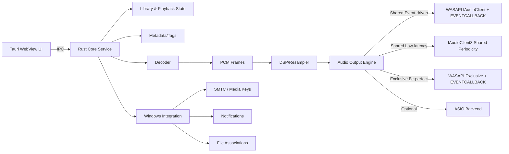
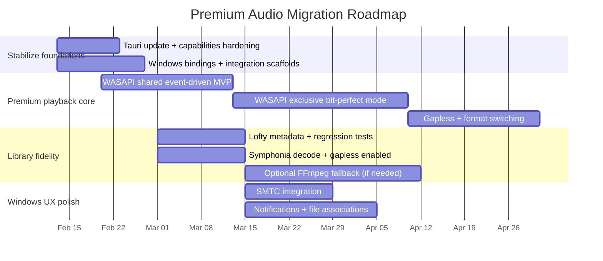

# Technical Stack Review for a Windows‑Native Music Player Focused on Premium Audio

## Executive summary

Your stack table was not included in the prompt, so every “current” stack item/version is **unspecified** and I proceed without questions as requested. This prevents me from making stack‑specific judgments (e.g., “your decoder is X, your output is Y”). Instead, I evaluate the *typical* Windows/Tauri/Rust decision points implied by your requirements (premium audio quality, low latency, broad format support, high‑fidelity metadata, and Windows‑native integration), identify the most common gaps that block those goals, and provide concrete, migration‑scoped recommendations with versions, trade‑offs, and validation steps.

The biggest architectural fork for your goals is **audio output**:

- If you stay on a cross‑platform audio abstraction (often via cpal/rodio), you can ship faster but you usually **cannot guarantee bit‑perfect output** or tight control over shared/exclusive behavior and resampling, and feature coverage depends on what the abstraction exposes. Evidence: cpal emphasizes host/device/stream abstractions and ASIO as an optional feature, but its docs do not advertise a first‑class “exclusive mode” control surface, and WASAPI exclusive support has historically been debated at the issue level rather than surfaced as a stable API. citeturn28search20turn29view0turn14view0  
- If you implement a **Windows‑native audio engine** (direct WASAPI via the windows crate or a safe WASAPI wrapper), you gain the control needed for **bit‑perfect playback, event‑driven low jitter buffering, and predictable device/format negotiation** (including exclusive mode). This comes with higher migration cost but is the most direct route to your stated “premium audio” goals. WASAPI’s IAudioClient model explicitly distinguishes shared (audio engine) vs exclusive (hardware buffer) streams. citeturn18search8turn19search17  

Recommended “target stack” (versions are current as of 2026‑02‑12):

- App shell: Tauri **v2.10.2** (keep, but lock down IPC/security and keep current). citeturn40search10turn6search0  
- Windows API bindings: windows crate **v0.62.2**. citeturn13search9turn40search1  
- Audio output: **Direct WASAPI** (windows crate) *or* wasapi crate **v0.22.0** as a safe wrapper (still Windows‑only). citeturn43view0turn20search0  
- Decode: Symphonia **v0.5.5** for pure‑Rust decode (gapless supported but must be enabled); add FFmpeg (ffmpeg‑sys‑next **v8.0.1** / ffmpeg‑next **v8.0.0**) only if you truly need the extra formats and accept licensing/build complexity. citeturn12view0turn34view0turn44search18turn31view2turn9search1  
- Metadata: Lofty **v0.23.1** (broad tag coverage; note its read‑only caveats on some formats). citeturn36view1turn36view0  
- Optional pro‑audio path: ASIO via cpal **v0.17.1** *only if you can satisfy licensing and support costs*. cpal documents an ASIO backend and setup flow; Steinberg provides an “open source variant” under GPLv3, which is typically incompatible with closed‑source distribution, so a proprietary license path may still be required depending on your distribution model. citeturn14view0turn42search1turn17search6turn17search1  

## Stack inventory from provided table

**Stack table status:** not present in the message. Therefore:

- UI shell/framework: **unspecified**
- Backend language/runtime: **unspecified**
- Audio output library/API: **unspecified**
- Decode stack: **unspecified**
- Metadata/tag stack: **unspecified**
- Resampling/DSP stack: **unspecified**
- Windows integration (SMTC, notifications, file associations): **unspecified**
- Packaging/distribution (MSIX/installer): **unspecified**

Because your prompt explicitly calls out Tauri security/IPC considerations, I assume your app is either already using Tauri or you intend to, but **the version is unspecified** (and I do not treat that as confirmed).

Practical implication: I treat the “current” column in the comparison table as **unspecified**, then provide a “recommended” column that is coherent for your goals and consistent with primary sources.

## Audio playback engine options for premium quality

Your goals (“bit‑perfect, gapless, correct resampling, low‑latency”) map cleanly to specific Windows audio behaviors and APIs.

### What “premium audio on Windows” requires in practice

**Bit‑perfect playback** on Windows almost always implies:
- **Exclusive mode render** (AUDCLNT_SHAREMODE_EXCLUSIVE), because shared mode routes through the system audio engine. WASAPI’s core description explicitly frames shared streams as using the audio engine and exclusive streams as using the hardware buffer. citeturn18search8turn19search17  
- **Correct format negotiation**: probe the device for supported formats, then open the stream in the exact PCM format you will deliver. WASAPI provides IsFormatSupported for this. citeturn28search4  
- **Event‑driven buffering** (AUDCLNT_STREAMFLAGS_EVENTCALLBACK + SetEventHandle) to reduce timing jitter and unnecessary wakeups. Microsoft’s WASAPI samples and docs cover event‑driven shared render, and SetEventHandle exists specifically to signal buffer readiness. citeturn8search0turn13search4  
- **Gapless** is primarily a decoder + scheduling responsibility, not a WASAPI feature. Your decoder must expose encoder delay/padding metadata and you must schedule contiguous PCM without inserting silence.

**Low latency** on Windows typically requires:
- **Small device period / small buffer** and an audio thread prioritized appropriately. Exclusive mode streams are documented as using MMCSS task names (e.g., “Pro Audio” for <10ms device period). citeturn19search2  
- Where available, **IAudioClient3** enables negotiating shared‑mode periodicities and initializing a shared stream with a specified periodicity (lower‑latency shared mode). citeturn7search15  

**Correct resampling** depends on which mode you choose:
- In shared mode, the “mix format” is the audio engine’s internal processing format (GetMixFormat). citeturn19search3turn19search1  
- Microsoft’s “Device Formats” guidance states that shared‑mode clients can rely on only **limited** format conversions and that an application stream typically must match device stream format in channel count and sample rate. citeturn19search1  
This strongly pushes a premium player to either (a) render in exclusive mode with native track sample rate, or (b) own the resampler and deliver exactly what the shared engine/device expects.

### Recommended output architecture

A practical, premium‑oriented output design is a **multi‑backend “Audio Output Engine”** with explicit modes:

- **WASAPI Shared (event‑driven)**: default, max compatibility.
- **WASAPI Shared (IAudioClient3 low‑latency)**: optional, lower latency shared mode where supported. citeturn7search15  
- **WASAPI Exclusive (event‑driven)**: “audiophile mode” for bit‑perfect, automatic sample‑rate switching. Exclusive‑mode constraints (e.g., periodicity requirements under EVENTCALLBACK) are spelled out in IAudioClient::Initialize docs. citeturn28search22turn19search2  
- **ASIO (optional)**: for pro users; high support burden + licensing complexity. cpal documents an ASIO backend feature and setup steps. citeturn14view0turn42search1  

Because cpal/rodio prioritize cross‑platform abstractions, I treat them as best for **MVP and portability**, not for “premium Windows playback” where you need exclusive/event‑driven/format negotiation control surfaced as first‑class product capability. cpal does document ASIO as a Windows backend and provides device/stream abstractions, but it does not present an “exclusive mode render” API in its public docs, and exclusive‑mode support in cpal has historically been discussed as a feature request. citeturn14view0turn29view0  

### Audio pipeline diagram



## Decode, resampling, and metadata fidelity

### Decode layer: Symphonia vs FFmpeg vs Media Foundation

**Symphonia (pure Rust)**
- Formats/codecs: Symphonia documents supported containers/codecs and makes clear that non‑default formats/codecs require feature flags. It also explicitly covers “gapless playback” support and how to enable it. citeturn12view0turn34view0  
- Gapless: Symphonia states gapless playback is disabled by default and must be enabled via FormatOptions::enable_gapless. citeturn12view0turn12view1  
- Licensing: MPL‑2.0 in its Cargo metadata. citeturn34view0  
- Risk: compared to FFmpeg, you will have fewer esoteric formats/codecs; you must decide which feature flags to enable.

**FFmpeg via ffmpeg‑sys‑next / ffmpeg‑next**
- Coverage: best‑in‑class format breadth (practically), plus swresample. ffmpeg‑sys‑next exposes build flags for licensing modes (e.g., build‑license‑gpl, build‑license‑nonfree) in its features, reflecting the underlying licensing complexity. citeturn33view1turn31view2  
- Licensing: FFmpeg itself is LGPL v2.1+ by default, but optional components can make the effective license GPL (and other options exist). citeturn9search1turn9search0  
- Practical cost: Windows distribution and build reproducibility can be nontrivial (toolchain, dynamic vs static linking, codec selection), and you must be disciplined about which FFmpeg configuration you ship.

**Media Foundation (Windows built‑in)**
- Native support is **limited**. Microsoft’s “Supported Media Formats in Media Foundation” page lists containers/codecs such as MP3, MPEG‑4 (m4a/mp4), AAC, WMA, and some ACM codecs—noticeably not a broad “audiophile library player” set (e.g., no FLAC listed on that page). citeturn22view0turn18search3turn21search2  
- Upside: OS‑integrated, potentially good DRM story compared to open decoders (depending on scenario), and straightforward integration with some Windows media plumbing.
- Downside: format breadth mismatch for typical local music libraries and less direct control over decoding edge cases (gapless, metadata quirks).

**Recommendation**
- Use **Symphonia as your default decoder** if you want a Rust‑native pipeline and you can live with its format set (and are willing to enable specific feature flags). citeturn12view0turn34view0  
- Add an **FFmpeg fallback** only if you have a clear “must support” list that Symphonia cannot meet and you are prepared for licensing/build engineering. citeturn9search1turn33view1  
- Do not rely on Media Foundation alone for a modern “plays my whole library” app unless your scope is intentionally narrow. citeturn22view0  

### Resampling strategy: “correct” means explicitly owned

Windows shared mode revolves around the **mix format** (GetMixFormat), which is “the stream format that the audio engine uses for its internal processing of shared‑mode streams.” citeturn19search3  

Microsoft guidance on Device Formats indicates shared‑mode apps can rely on only limited conversions and that application stream sample rate/channel count typically must match the device stream format—meaning you should not assume Windows will resample everything you throw at it. citeturn19search1  

**Recommendation**
- Implement explicit resampling in your pipeline whenever decoded PCM sample rate ≠ chosen output sample rate.
- For bit‑perfect mode, prefer **exclusive mode** and open the device in the track’s native sample rate/bit depth where supported (fall back to resampling only if the device cannot open that format). The IAudioClient interface and exclusive‑mode documentation support the notion that exclusive streams are directly tied to device behavior and have specific MMCSS/period semantics. citeturn18search8turn19search2turn28search4  

### Metadata fidelity: Lofty as a strong Rust‑native baseline

Lofty documents broad support across common audio formats and tag types, and it explicitly notes caveats where some tag types are read‑only due to lack of official support. citeturn36view1  
Lofty also ships explicit testing guidance (with logging) and mentions benchmarking support. citeturn36view0  

**Recommendation**
- Use Lofty **v0.23.1** as your primary tags/metadata layer. citeturn36view1  
- Build a “metadata fidelity contract” around:
  - Round‑trip correctness for your supported tag types,
  - Picture extraction/embedding behavior,
  - Preservation of unknown frames/atoms where feasible (if your product promises “don’t destroy my tags”).

## Tauri security model and Windows‑native integration

### Security and IPC/sandboxing in Tauri

Tauri’s modern security posture is built around:
- A security model and guidance emphasizing safe design for desktop apps with web frontends. citeturn0search3  
- **Capabilities** as a permission system controlling which windows/webviews are allowed to access specific backend commands, and how IPC is constrained. citeturn0search7turn0search10  
- The **isolation pattern** to reduce risk when rendering untrusted content. citeturn0search11  

**Recommendation (security posture)**
- Treat the UI as untrusted and keep the audio engine + filesystem access in the Rust side behind a minimal command surface, using capabilities to scope what each window can call. citeturn0search7turn0search10  
- Avoid loading remote web content inside the privileged webview. If you need remote content (lyrics, cover art), fetch it on the Rust side with strict allow‑lists and pass results as data, not by navigating the webview.
- Keep Tauri updated; Tauri’s release channel shows active cadence and specific versions for core components. citeturn40search10turn6search0  

### Windows‑native UX: SMTC/media keys, notifications, file associations

**System Media Transport Controls (SMTC) / media keys**
- The SMTC API supports manual configuration for non‑UWP apps via SystemMediaTransportControls, enabling metadata presentation and transport control integration. citeturn0search9turn0search6  
**Recommendation:** implement SMTC from Rust via the windows crate (WinRT bindings), and treat it as a first‑class part of your playback state machine.

**Notifications**
- Desktop toast (app notification) support requires correct identity/registration patterns. Microsoft documents enabling desktop toast notifications via AppUserModelID and provides guidance for desktop toasts and app notifications in the Windows App SDK context. citeturn10search0turn10search4turn10search1  
**Recommendation:** decide early whether you will ship as packaged (MSIX) or unpackaged; notification activation patterns and setup differ. citeturn10search1turn10search4  

**File associations / default app**
- Microsoft documents file type associations in the package manifest schema (uap:FileTypeAssociation) and broader guidance on integrating packaged desktop apps with Windows via manifest extensions. citeturn11search0turn11search2  
**Recommendation:** if Windows‑native UX is a goal, strongly consider MSIX packaging so you can use manifest‑based integrations rather than ad‑hoc registry writes. citeturn11search2turn10search9  

## Comparison table and migration plan

### Current vs recommended options

Because your stack table is missing, all “current” entries are **unspecified**.

| Layer | Current (authoritative table) | Recommended (versions) | Why it’s recommended for your goals | Key trade‑offs | Migration notes + difficulty + time‑to‑MVP |
|---|---|---|---|---|---|
| App shell / UI host | Unspecified | Tauri **v2.10.2** citeturn40search10turn6search0 | Active release cadence; security system (capabilities/isolation) suited to a Rust core with a web UI citeturn0search7turn0search11 | WebView footprint and the usual “web UI in desktop” constraints | If already on Tauri v2.x, update + harden config (3/10, ~1–3 days). If migrating from another shell, higher (6/10, ~2–4 weeks). |
| Windows API bindings | Unspecified | windows crate **v0.62.2** citeturn40search1turn13search9 | Direct access to Win32 + WinRT for WASAPI + SMTC + notifications | Larger API surface; COM/WinRT complexity | If already using windows crate, minor. Otherwise moderate (4/10, ~1–2 weeks to become productive). |
| Audio output | Unspecified | Direct WASAPI via windows crate (shared+exclusive, event‑driven), or wasapi crate **v0.22.0** citeturn18search8turn8search0turn28search22turn43view0 | Enables bit‑perfect exclusive mode, event‑driven buffering, explicit device/format control | Windows‑only; higher engineering cost | If currently on cpal/rodio output: implement WASAPI engine behind a trait and keep old backend as fallback (7/10, ~4–8 weeks for solid shared+exclusive MVP). |
| Low‑latency shared mode | Unspecified | Add IAudioClient3 path where supported citeturn7search15turn19search17 | Allows negotiating supported periodicities and requesting shared stream periodicity | More code paths, more QA matrix | Optional “phase 2” after stable shared/exclusive engine (6/10, ~1–2 weeks). |
| ASIO (optional) | Unspecified | cpal **v0.17.1** with `asio` feature for pro audio users citeturn14view0turn42search1 | Bypasses Windows audio stack; can achieve low latency on ASIO devices | Licensing/distribution complexity; driver variability; higher support burden. Steinberg’s “open source variant” is GPLv3 which is usually incompatible with closed‑source apps citeturn17search6turn17search1 | Only implement if you explicitly target audio interfaces/DAW users (8/10, ~4–10 weeks including support + testing). |
| Decode | Unspecified | Symphonia **v0.5.5** citeturn12view0turn34view0 | Pure Rust; explicit gapless support (must enable) | Less format breadth than FFmpeg | Good default. If you need “everything,” add FFmpeg fallback (see below). Symphonia integration MVP (3/10, ~1 week). |
| Decode fallback | Unspecified | ffmpeg‑sys‑next **v8.0.1** / ffmpeg‑next **v8.0.0** citeturn44search18turn31view2turn33view1 | Maximum codec/container coverage; swresample available | Licensing complexity (LGPL/GPL depending on configuration) citeturn9search1; build/distribution complexity | Only if required. Fallback integration (6/10, ~2–6 weeks + legal review). |
| Metadata/tags | Unspecified | Lofty **v0.23.1** citeturn36view1turn36view0 | Broad tag support; explicit notes about read‑only cases; test/bench guidance | Still requires you to define rules for “preserve unknown fields” vs “normalize” | Migration from ad‑hoc tagging (4/10, ~1–2 weeks). |
| Windows integration | Unspecified | SMTC + toast notifications + file association via WinRT/manifest patterns citeturn0search9turn10search4turn11search0turn11search2 | Delivers Windows‑native UX expectations | Packaging/identity complexity | Implement SMTC early (5/10, ~1–2 weeks). Notifications/file assoc depend heavily on packaging choice (4–7/10, ~1–4 weeks). |

### Suggested migration phases (Mermaid)



## Tests, benchmarks, and validation checklist

### System‑level tracing for glitches, dropouts, and latency

**ETW collection with WPR (command‑line)**
Microsoft’s WPT lab explicitly recommends WPR for media scenarios and provides concrete commands. citeturn24view0turn16search0  

Run (admin):

```cmd
wpr -cancel
wpr -start Media.wprp -filemode
REM reproduce playback glitches / device switching / seek storms
wpr -stop Media.etl
```

Analyze:
- Use WPA or MXA workflows from Microsoft’s “audio glitches” lab; it attributes common glitch causes including long DPC/ISR, drivers at dispatch level, disk/network stalls, or decode pipeline not meeting real‑time. citeturn24view1turn16search9  

**What to look for**
- Correlate glitches with DPC/ISR spikes and CPU scheduling stalls. Microsoft’s lab highlights DPC/ISR >1ms as a frequent cause. citeturn24view1  
- Check whether decode threads are starving the render thread or if your render callback blocks on IO locks.

### App‑level latency/underrun measurement

**Buffer and latency sweeps**
- For each output mode (shared, shared‑low‑latency, exclusive), sweep buffer sizes / periods and measure:
  - underrun count,
  - average callback execution time,
  - max callback execution time,
  - glitch events per hour.

WASAPI provides GetDevicePeriod and GetStreamLatency for measurement. citeturn7search14turn18search0  

**Underrun/glitch tracking**
- Track:
  - current padding,
  - render starvation events,
  - time spent between event wakeups.  
For event‑driven buffering, SetEventHandle is designed to signal “buffer ready.” citeturn13search4  

### Regression tests for metadata fidelity

Using Lofty, create a golden corpus and test:
- Read → write → read equality for stable tags.
- Preservation (or intentional normalization) of:
  - ID3v2 frames (including comments, album artist, replaygain),
  - MP4 atoms (ilst),
  - Vorbis comments (FLAC/OGG/Opus).  
Lofty’s supported formats and “read‑only” caveats should define your “supported contract.” citeturn36view1  

### Decode correctness tests

- Gapless: verify continuous PCM across track boundaries for formats where your decoder supports it. Symphonia notes that gapless requires support from both demuxer and decoder, and must be enabled via FormatOptions::enable_gapless. citeturn12view0turn12view1  
- Seek correctness: ensure sample‑accurate seek positions and no post‑seek silence insertion.
- Stress: parallel library scan + playback + waveform generation.

## Code and API notes for critical integrations

All snippets are intentionally minimal and focus on the “shape” of the integration. They are not complete audio engines (a complete engine should include COM init, error mapping, format negotiation, channel layout handling, and robust shutdown).

### WASAPI device enumeration (Win32 IMMDeviceEnumerator)

WASAPI device enumeration is based on IMMDeviceEnumerator and EnumAudioEndpoints / GetDefaultAudioEndpoint. citeturn7search17turn7search9  

```rust
// Sketch only (no error handling shown).
// Requires windows crate and relevant Win32 feature flags.

use windows::Win32::Media::Audio::*;
use windows::Win32::System::Com::*;
use windows::Win32::Devices::FunctionDiscovery::*;
use windows::core::Interface;

fn enumerate_render_devices() -> windows::core::Result<()> {
    unsafe { CoInitializeEx(None, COINIT_MULTITHREADED)?; }

    let enumerator: IMMDeviceEnumerator =
        unsafe { CoCreateInstance(&MMDeviceEnumerator, None, CLSCTX_ALL)? };

    let devices = unsafe { enumerator.EnumAudioEndpoints(eRender, DEVICE_STATE_ACTIVE)? };
    let count = unsafe { devices.GetCount()? };

    for i in 0..count {
        let dev = unsafe { devices.Item(i)? };
        // From here: dev.OpenPropertyStore + PKEY_Device_FriendlyName, etc.
        // Or dev.Activate to get IAudioClient for capability probing.
        let _ = dev;
    }
    Ok(())
}
```

### WASAPI shared vs exclusive + event‑driven buffering

Key facts from Microsoft docs:

- IAudioClient is the primary interface; shared mode connects to the audio engine, exclusive mode connects to the hardware buffer. citeturn18search8  
- Event‑driven buffering: Initialize supports AUDCLNT_STREAMFLAGS_EVENTCALLBACK, and you use SetEventHandle for the system to signal readiness. citeturn8search0turn13search4  
- In exclusive+eventcallback, hnsPeriodicity must be nonzero and equal to hnsBufferDuration. citeturn28search22  
- For render, GetBuffer/ReleaseBuffer must occur on the same thread. citeturn18search5  

```rust
// Sketch only: event-driven render loop structure.
// Shared vs Exclusive differs in Initialize share mode and format negotiation.

use windows::Win32::Media::Audio::*;
use windows::Win32::Foundation::*;
use windows::Win32::System::Threading::*;

fn event_driven_render_loop(audio_client: IAudioClient) -> windows::core::Result<()> {
    unsafe {
        // Create an auto-reset event object for WASAPI
        let h_event = CreateEventW(None, false, false, None)?;
        audio_client.SetEventHandle(h_event)?;

        // Obtain render client
        let render: IAudioRenderClient = audio_client.GetService()?;

        audio_client.Start()?;

        loop {
            // Wait until endpoint buffer is ready.
            WaitForSingleObject(h_event, 2000);

            // Determine how many frames to write: buffer_size - current_padding
            // (GetBufferSize/GetCurrentPadding calls omitted here)

            let frames_to_write: u32 = 0; // compute properly

            let data_ptr = render.GetBuffer(frames_to_write)?;
            // Fill data_ptr with PCM frames (interleaved) matching the negotiated format.
            // ...
            render.ReleaseBuffer(frames_to_write, 0)?;
        }
    }
}
```

**Where resampling control fits**
- Shared mode: choose the mix format (GetMixFormat) or a format compatible with it. GetMixFormat is defined as the audio engine’s internal processing format. citeturn19search3turn19search1  
- Exclusive mode: negotiate a device format via IsFormatSupported and open that exact format. citeturn28search4  

### WASAPI loopback capture

Microsoft’s loopback recording doc: loopback captures the audio stream being played by a rendering endpoint device and requires initializing a capture stream in loopback mode on that rendering endpoint. citeturn20search18  

Also, Microsoft documentation notes exclusive‑mode streams cannot operate in loopback mode. citeturn7search20  

```rust
// Sketch: loopback capture uses a capture client on the *render* endpoint with LOOPBACK flag.
// Shared mode only (exclusive cannot do loopback per docs).

use windows::Win32::Media::Audio::*;

fn loopback_capture(audio_client: IAudioClient) -> windows::core::Result<()> {
    unsafe {
        // Initialize with AUDCLNT_STREAMFLAGS_LOOPBACK (+ EVENTCALLBACK if desired)
        // audio_client.Initialize(AUDCLNT_SHAREMODE_SHARED, AUDCLNT_STREAMFLAGS_LOOPBACK, ...)

        let capture: IAudioCaptureClient = audio_client.GetService()?;
        audio_client.Start()?;

        loop {
            let mut next = 0u32;
            // In shared mode, GetNextPacketSize tells frames in next packet.
            capture.GetNextPacketSize(&mut next)?;
            if next == 0 {
                // Sleep or wait on event if using event-driven capture
                continue;
            }

            // GetBuffer -> read -> ReleaseBuffer (details omitted)
        }
    }
}
```

Capture packet APIs:
- GetNextPacketSize returns frames in next packet. citeturn25search0  
- GetBuffer/ReleaseBuffer semantics are specified in Microsoft docs. citeturn25search1turn25search5  

### Sample‑rate adjustment in shared mode (RATEADJUST)

If you need fine drift correction (e.g., sync scenarios), Windows provides AUDCLNT_STREAMFLAGS_RATEADJUST and IAudioClockAdjustment, but it is not supported for exclusive mode and is tied to shared mode initialization requirements. citeturn25search2turn18search4turn25search6  

### WASAPI via windows crate vs cpal/rodio vs wasapi crate

**Direct via windows crate**
- Maximum control surface for exclusive/shared/event‑driven/IAudioClient3/SMTC. citeturn18search8turn7search15turn40search1  

**via wasapi crate (safe wrapper)**
- wasapi crate states it provides safe Rust access closely following the Windows API, and its Cargo metadata shows it builds on windows crate. citeturn20search0turn43view0  
- Good for reducing COM/unsafe boilerplate, but you must verify it exposes the exact advanced features you need (exclusive event‑driven quirks, IAudioClient3, etc.) before committing.

**via cpal/rodio**
- rodio: playback handled by cpal; decoding by Symphonia by default (or optional decoders). citeturn15view1  
- cpal: ASIO feature exists; intended as a cross‑platform I/O abstraction with host/device/stream concepts. citeturn14view0turn42search1turn28search20  
- This is great when you don’t want to own platform audio details; it is not the cleanest path to guaranteed bit‑perfect + exclusive mode product features.

### Decoding via Symphonia (gapless enabled) vs FFmpeg

**Symphonia gapless enablement**
Symphonia states gapless is disabled by default and must be enabled via FormatOptions::enable_gapless. citeturn12view0turn12view1  

```rust
// Sketch: enabling gapless in Symphonia.
use symphonia::core::formats::FormatOptions;

fn format_options_for_playback() -> FormatOptions {
    let mut opt = FormatOptions::default();
    opt.enable_gapless = true;
    opt
}
```

**FFmpeg licensing warning**
Even if rust wrapper crates are permissively licensed (they may list WTFPL in Cargo metadata), FFmpeg itself is licensed LGPL v2.1+ by default, with optional GPL components—your effective obligations depend on how you build and ship FFmpeg. citeturn9search1turn31view2turn33view1